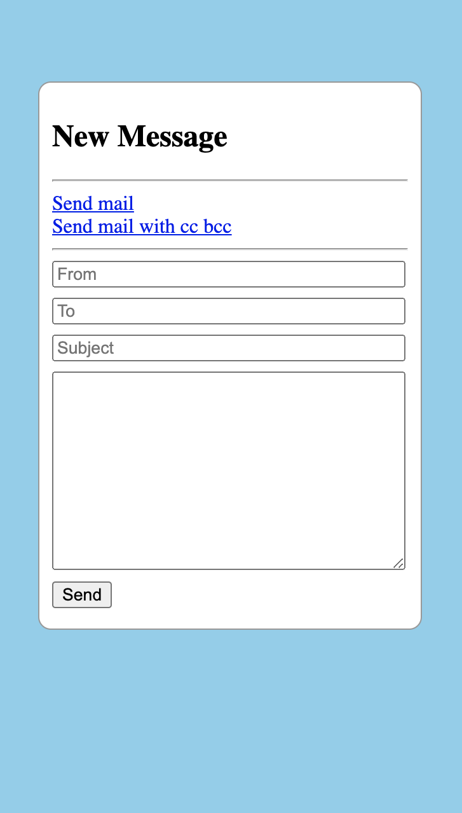
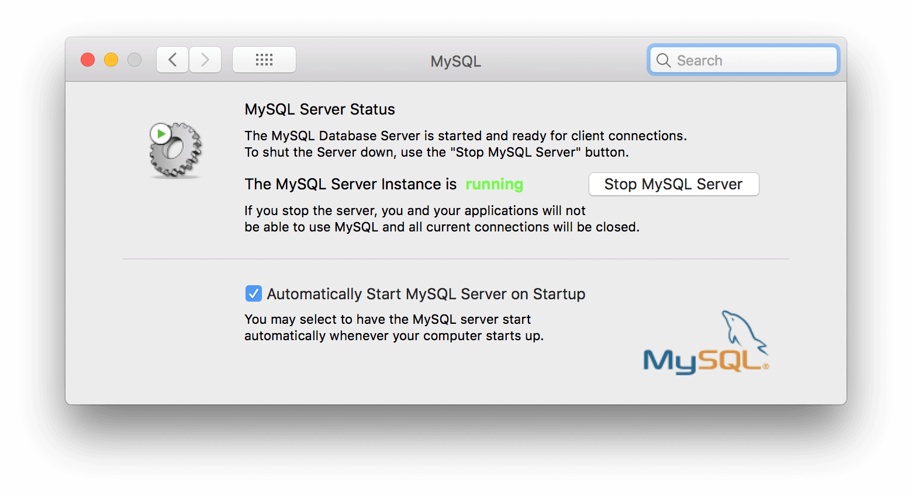
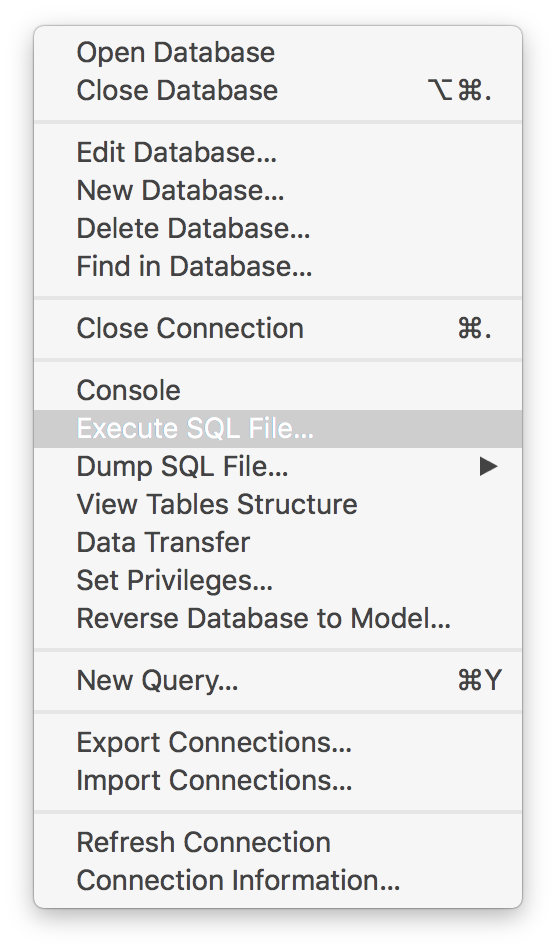
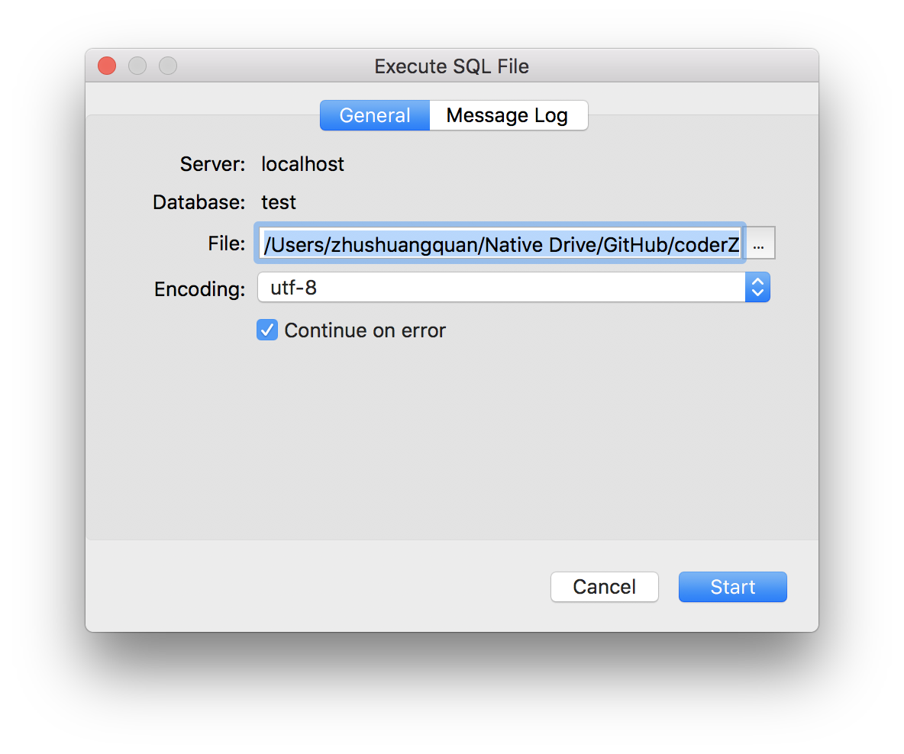

## Find inspiration in practice

### mail
> Browser sending mail **implemention** and server sending mail **implemention**.

#### Contents
- **JavaMail:** Practice of sending mail using java api.
 
#### Display

 

### resume
>Practice building a server through java, and **interact** with the front-end.

#### Get Started
- Step 1. you need a [JVM](https://www.java.com/zh_CN/) server environment.
- Step 2. you need a [MySQL](https://www.mysql.com/downloads/) database.
- Step 3. you need config **nginx** & **maven** by yourself.
- Step 4. you need to start the **MySQL server**.

- Step 5. you need to excute SQL file.

- Then need to launch **tomcat server** at **localhost:8080**.

#### Contents

- **SSM:** **Spring** & **SpringMVC** & **MyBatis** practice.

#### Artical
- [Server 入门后端你要学什么 / 2017 / 11](https://coderzsq.github.io/2017/11/Server-%E5%85%A5%E9%97%A8%E5%90%8E%E7%AB%AF%E4%BD%A0%E8%A6%81%E5%AD%A6%E4%BB%80%E4%B9%88/)
- [Server 使用Spring来构建服务 / 2017 / 11](https://coderzsq.github.io/2017/11/Server-%E4%BD%BF%E7%94%A8Spring%E6%9D%A5%E6%9E%84%E5%BB%BA%E6%9C%8D%E5%8A%A1/)